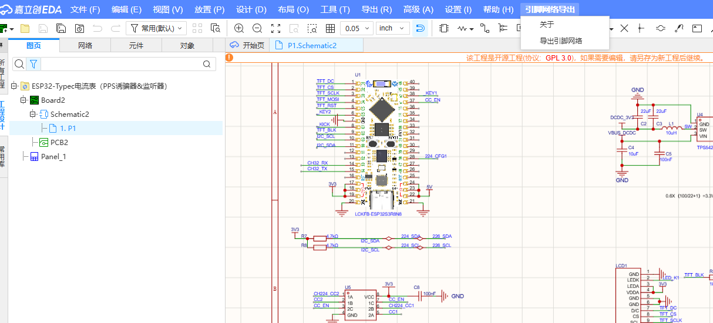
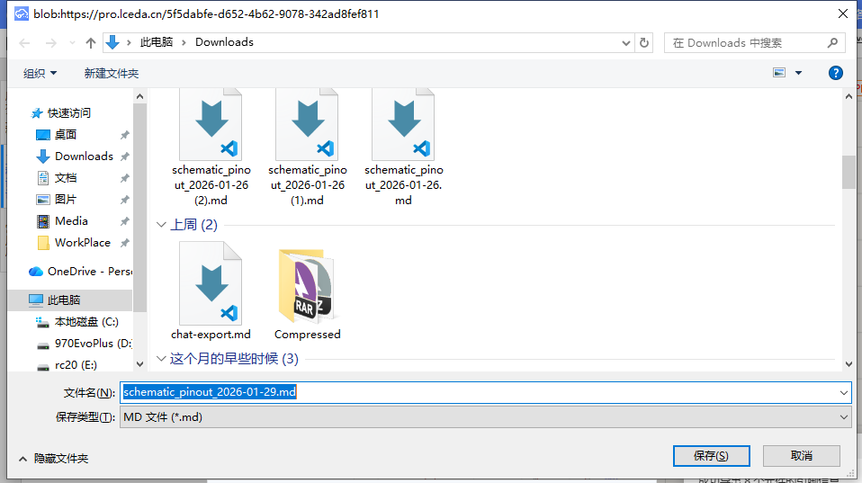
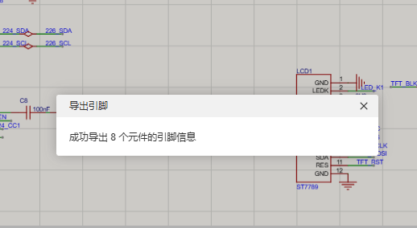
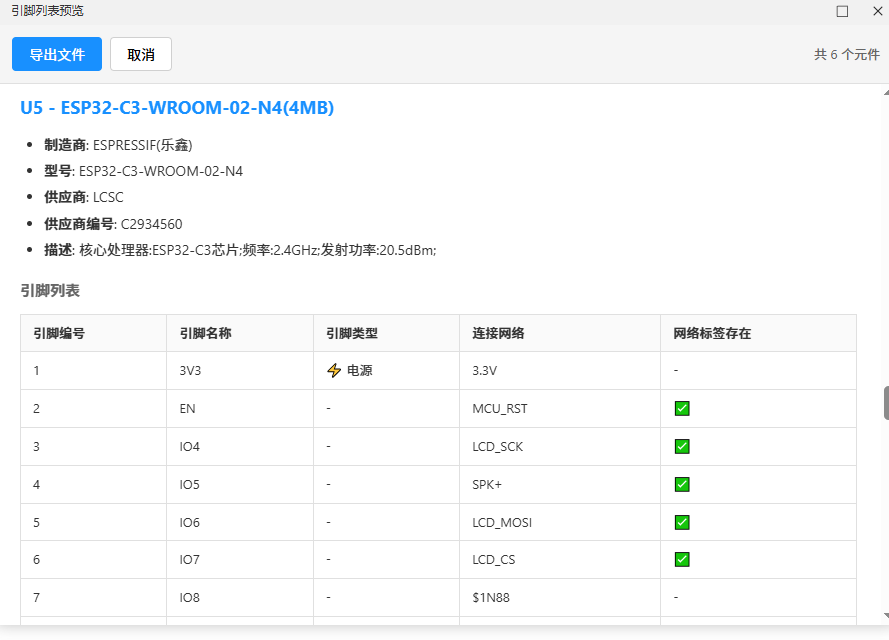

# 原理图引脚网络导出器

轻松导出原理图引脚，包括引脚编号、名称、类型和连接网络等信息，支持 Markdown 格式，提升设计效率。

## 功能特性

- **一键导出**：自动遍历所有原理图页面，提取芯片元件及其引脚信息
- **网络关联**：通过网表解析，显示每个引脚连接的网络名称
- **网络标签识别**：自动检测引脚是否连接了 NetPort（网络标签），便于确认信号命名
- **智能排序**：元件按引脚数量降序排列，引脚按编号升序排列
- **丰富信息**：包含元件位号、名称、制造商、型号、供应商、描述等
- **类型标识**：引脚类型使用 emoji 直观标识（输入/输出/双向/电源/地等）

## 功能预览
- 在原理图界面进行导出



- 选择导出位置



-  导出成功提示



- Markdown渲染导出结果


## 安装方法

1. 下载或构建扩展包（`.eext` 文件）
2. 打开嘉立创EDA专业版
3. 进入 **扩展管理** > **本地安装**
4. 选择扩展包文件完成安装

## 使用方法

1. 打开包含原理图的项目
2. 在顶部菜单栏找到 **引脚网络导出**
3. 点击 **导出引脚网络**
4. 选择保存位置，生成 Markdown 文件

## 输出格式示例

```markdown
# 原理图芯片引脚列表

> 导出时间: 2026/1/29 15:30:00
> 元件总数: 5

---

## U1 - STM32F103C8T6

- **制造商**: STMicroelectronics
- **型号**: STM32F103C8T6
- **描述**: ARM Cortex-M3 微控制器

### 引脚列表

| 引脚编号 | 引脚名称 | 引脚类型 | 连接网络 |
|:--------:|:---------|:---------|:---------|
| 1 | VBAT | ⚡ 电源 | +3.3V |
| 2 | PC13 | ↔️ 双向 | LED1 |
| 3 | PC14 | ➡️ 输入 | OSC32_IN |
...
```

## 引脚类型说明

| 类型 | 标识 |
|------|------|
| 输入 | ➡️ 输入 |
| 输出 | ⬅️ 输出 |
| 双向 | ↔️ 双向 |
| 无源 | ⚪ 无源 |
| 电源 | ⚡ 电源 |
| 地 | ⏚ 地 |
| 高阻 | 🚫 高阻 |
| 开集电极 | 🔓 开集电极 |
| 开发射极 | 🔓 开发射极 |
| 信号终端 | 🔚 信号终端 |

## 适用场景

- 核对硬件设计引脚分配
- 交付给软件开发人员进行驱动开发
- 与 AI 协作进行嵌入式软件开发
- 生成设计文档

## 兼容性

- **嘉立创EDA专业版**: ^3.0.0
- **Node.js**: >= 20.17.0（开发环境）

## 开发构建

```bash
# 安装依赖
npm install

# 编译
npm run compile

# 构建扩展包
npm run build
```

## 许可证

[Apache-2.0](LICENSE)

## 已知问题

- **NetPort 符号信息获取受限**：由于 EDA SDK 限制，`eda.lib_Symbol.get()` 无法获取 netport 组件的符号详细信息（ILIB_SymbolItem）。目前仅能获取 netport 的基础属性（网络名、坐标），无法获取符号名称、类型描述等。此问题待 SDK 修复或提供替代 API。
